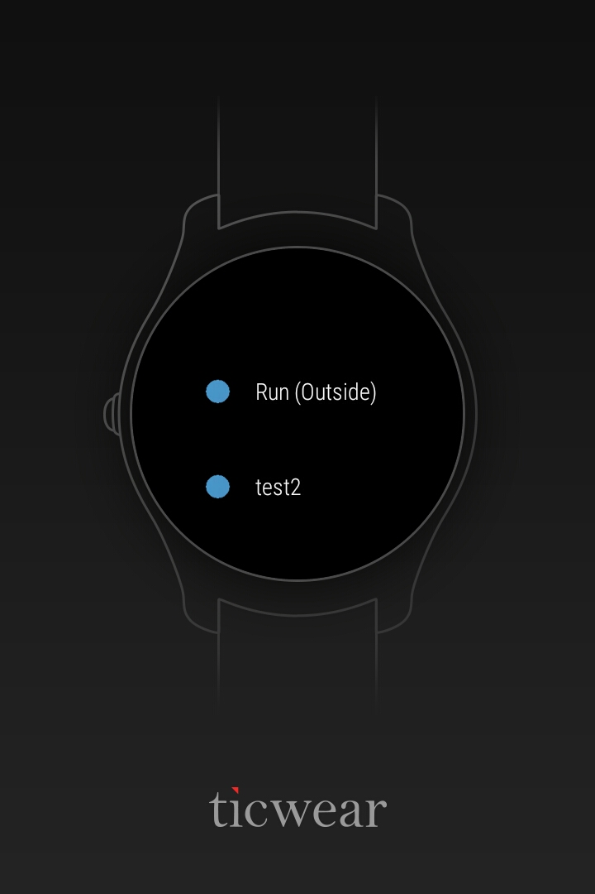
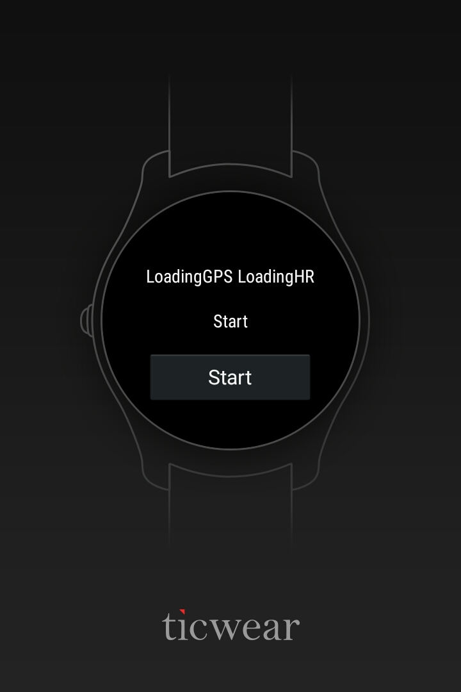
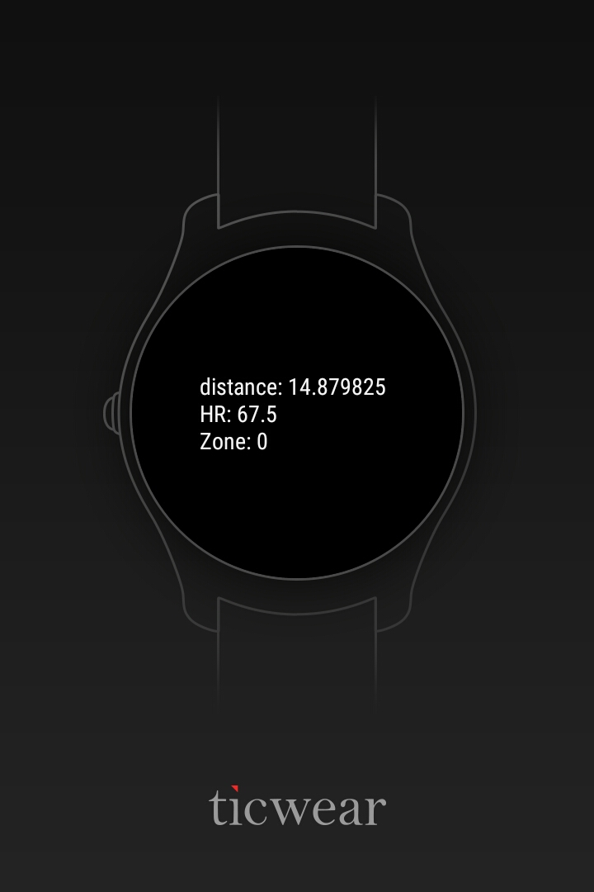
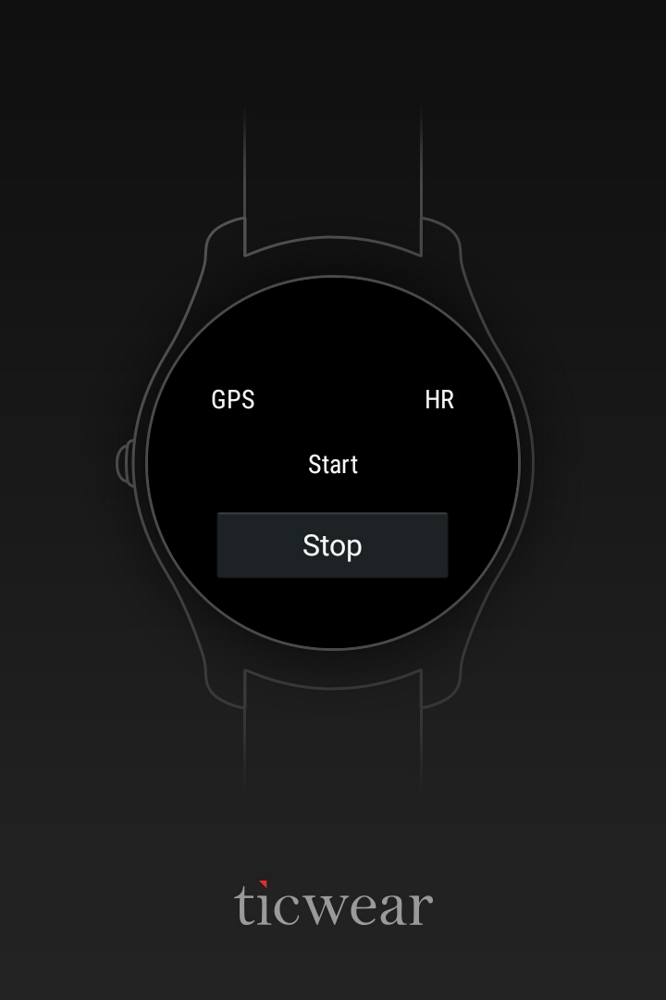

# README #

### What is this repository for? ###

TicFit is a run tracking app for the Mobvoi Ticwatch2

### How do I get set up? ###

1. Install [Android Studio](https://developer.android.com/studio/index.html)
2. Clone Repository
    * HTTPS
    ```
    git clone https://github.com/ThisIsNull/TicFitApp.git
    ```
  
   * SSH
    ```
    git clone git@github.com:ThisIsNull/TicFitApp.git
    ```
    
3. Import project to Android Studio
4. Ensure you can build the project

* Summary of set up
* Configuration
* Dependencies
* Database configuration
* How to run tests
* Deployment instructions

### Using The App ###

<table>
  <tr>
    <th>1. Click "Run (Outside)"</th>
    <th>2. This is the loading screen, wait until ready</th>
    <th>3. GPS and HR services are ready, click "Start"</th>
    <th>4. View information about activity</th>
    <th>5. Swipe right --> and click "Stop"</th>
  </tr>
  <tr>
    <td>   </td>
    <td>   </td>
    <td>  </td>
    <td>   </td>
    <td>   </td>
  </tr>
</table>

### GPX files ###
1. Retrieve GPX files from watch

 ```
 adb pull /sdcard/GPX <path/to/local/directory>
 ```
 
2. Remove GPX folder and fiels from watch

 ```
 adb shell rm -r /sdcard/GPX
 ```

### Contribution guidelines ###

1. Create or select an [issue](https://waffle.io/ThisIsNull/TicFitApp)
2. Do some awesome coding
3. Comment the code
4. Pull latest code from repo
5. Test and log results
6. Commit code and update the [issue](https://waffle.io/ThisIsNull/TicFitApp)
7. Code must be reviewed and approved by peer

### Other Links ###

* [GIT Guide](http://rogerdudler.github.io/git-guide/)
* [Android Guide & API](https://developer.android.com/index.html)
* [Ticwear API](http://developer.chumenwenwen.com/en/doc/ticwear.html)
* [Ticwear Forum](http://forum.ticwear.com/viewtopic.php?f=21&t=155&sid=0d780c77de83e40d0bd2060b8c0bf0e8)
* [Issue Tracker](https://waffle.io/ThisIsNull/TicFitApp)

### Who do I talk to? ###

* [TicFit Gitter](https://gitter.im/TicFitApp/Lobby?utm_source=share-link&utm_medium=link&utm_campaign=share-link)
* Repo owner or admin
* Other community or team contact
